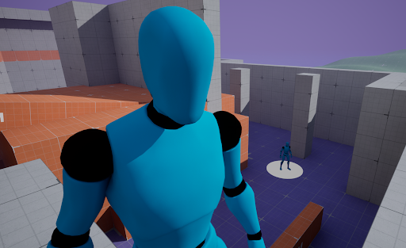

<!-- Improved compatibility of back to top link: See: https://github.com/othneildrew/Best-README-Template/pull/73 -->
<a id="readme-top"></a>
<!--
*** Thanks for checking out the Best-README-Template. If you have a suggestion
*** that would make this better, please fork the repo and create a pull request
*** or simply open an issue with the tag "enhancement".
*** Don't forget to give the project a star!
*** Thanks again! Now go create something AMAZING! :D
-->


<!-- PROJECT SHIELDS -->
<!--
*** I'm using markdown "reference style" links for readability.
*** Reference links are enclosed in brackets [ ] instead of parentheses ( ).
*** See the bottom of this document for the declaration of the reference variables
*** for contributors-url, forks-url, etc. This is an optional, concise syntax you may use.
*** https://www.markdownguide.org/basic-syntax/#reference-style-links
-->
[![Contributors][contributors-shield]][contributors-url]
[![Forks][forks-shield]][forks-url]
[![Stargazers][stars-shield]][stars-url]
[![Issues][issues-shield]][issues-url]
[![MIT License][license-shield]][license-url]
[![LinkedIn][linkedin-shield]][linkedin-url]


<!-- PROJECT LOGO -->
<br />
<p align="center">
  <a href="https://github.com/ClintGalvez/HumanLikeBehaviour">
    
  </a>

  <h3 align="center">Human-Like Behaviour</h3>

  <p align="center">
    Recreating human-like behaviour for game AI
    <br />
    <a href="https://docs.google.com/document/d/1C8d_nTgCR3ScNvusosiK2bYwZWZwxAmvZ2FONkGZxWc/edit?usp=sharing"><strong>Explore the report »</strong></a>
    <br />
    <br />
    <a href="https://github.com/ClintGalvez/HumanLikeBehaviour">View Demo</a>
    ·
    <a href="https://github.com/ClintGalvez/HumanLikeBehaviour/issues">Report Bug</a>
    ·
    <a href="https://github.com/ClintGalvez/HumanLikeBehaviour/issues">Request Feature</a>
  </p>
</p>


<!-- TABLE OF CONTENTS -->
<details>
  <summary>Table of Contents</summary>
  <ol>
    <li>
      <a href="#about-the-project">About The Project</a>
      <ul>
        <li><a href="#built-with">Built With</a></li>
      </ul>
    </li>
    <li>
      <a href="#getting-started">Getting Started</a>
      <ul>
        <li><a href="#prerequisites">Prerequisites</a></li>
        <li><a href="#installation">Installation</a></li>
        <li><a href="#tensorboard">Tensorboard</a></li>
      </ul>
    </li>
    <li><a href="#usage">Usage</a></li>
    <li><a href="#roadmap">Roadmap</a></li>
    <li><a href="#contributing">Contributing</a></li>
    <li><a href="#license">License</a></li>
    <li><a href="#contact">Contact</a></li>
    <li><a href="#acknowledgments">Acknowledgments</a></li>
  </ol>
</details>


<!-- ABOUT THE PROJECT -->
## About The Project

[![Human-Like Behaviour Research Project Screen Shot][project-screenshot]](https://clintgalvez.com/#projects)

This research project addresses the feasibility and challenges of creating human-like AI agents in video games; specifically focusing on developing agents that can follow targets while remaining hidden. Traditional game AI often becomes predictable, diminishing player immersion and enjoyment over time. To overcome this limitation, a 3D game with complex graphics and mechanics alongside an environment inspired by stealth-based games was developed. Featuring multiple navigation pathways with distinct risk-reward dynamics. The environment incorporates variable-height obstacles, strategic cover points, and open areas to encourage complex decision-making.

Using Unreal Engine's Learning Agents plugin, reinforcement and imitation learning approaches were implemented with carefully designed reward systems that balance target visibility with stealth. The agent's perception system processes self-position, target location, and environmental data to inform decision-making, while the NPC employs sight, hearing, touch, and prediction capabilities to create challenging scenarios for the learning agent.

The results demonstrate that the AI successfully learned behaviours that bridge the gap between rigid, scripted bots and complex human players. Eventually concluding that creating convincing human-like AI is most effectively achieved through a hybrid approach that synthesizes neural networks with behaviour trees, where machine learning focuses on selecting appropriate predefined behaviours rather than controlling low-level continuous actions. This modular system offers a pragmatic and scalable solution for developing immersive, adaptive AI in games.

<p align="right">(<a href="#readme-top">back to top</a>)</p>


### Built With

* [Unreal Engine](https://www.unrealengine.com)
* [Motion Matching Plugin](https://dev.epicgames.com/documentation/en-us/unreal-engine/motion-matching-in-unreal-engine)
* [Learning Agents Plugin](https://dev.epicgames.com/community/learning/courses/GAR/unreal-engine-learning-agents-5-5/bZnJ/unreal-engine-learning-agents-5-5)

<p align="right">(<a href="#readme-top">back to top</a>)</p>


<!-- GETTING STARTED -->
## Getting Started

To get a local copy up and running follow these simple steps.

### Prerequisites

This is an example of how to list things you need to use the software and how to install them.
* Unreal Engine 5.5
  ```sh
  download and install UE 5.5 from the Epic Games Launcher
  ```

### Installation

1. Clone the repo
    ```sh
    git clone https://github.com/ClintGalvez/HumanLikeBehaviour.git
    ```
2. Open the Unreal Engine Project File with Unreal Engine 5.5 
    ```sh
    HumanLikeBehaviour.uproject
    ```

### Tensorboard

**Note: as of UE 5.5, you may come across and issue where the plugin fails to find tensorboard within the Engine files, so to fix this we'll have tensorboard installed within the project files instead of the Engine files**

#### Installation

1. (Optional) open the project in Unreal to generate the required `Intermediate` folder
2. within the project directory `{Path to PROJECT}` navigate to the following directory `\Intermediate\PipInstall\Scripts`
    ```sh
    {Path to PROJECT}\Intermediate\PipInstall\Scripts
    ```
3. run the following pip command to install tensorboard
    ```sh
    ./python -m pip install tensorboard
    ```

#### Run

1. go to the following directory
    ```sh
    {Path to PROJECT}\Intermediate\PipInstall\Scripts
    ```
2. run the following command
    ```sh
    tensorboard --logdir={Path to PROJECT}\Intermediate\LearningAgents\TensorBoard\runs
    ```

<p align="right">(<a href="#readme-top">back to top</a>)</p>


<!-- USAGE EXAMPLES -->
## Usage

Use this space to show useful examples of how a project can be used. Additional screenshots, code examples and demos work well in this space. You may also link to more resources.

_For more examples, please refer to the [Documentation](https://example.com)_

<p align="right">(<a href="#readme-top">back to top</a>)</p>


<!-- ROADMAP -->
## Roadmap

- [ ] Feature 1
- [ ] Feature 2
- [ ] Feature 3
    - [ ] Nested Feature

See the [open issues](https://github.com/ClintGalvez/HumanLikeBehaviour/issues) for a list of proposed features (and known issues).

<p align="right">(<a href="#readme-top">back to top</a>)</p>


<!-- CONTRIBUTING -->
## Contributing

Contributions are what make the open source community such an amazing place to learn, inspire, and create. Any contributions you make are **greatly appreciated**.

If you have a suggestion that would make this better, please fork the repo and create a pull request. You can also simply open an issue with the tag "enhancement".
Don't forget to give the project a star! Thanks again!

1. Fork the Project
2. Create your Feature Branch (`git checkout -b feature/AmazingFeature`)
3. Commit your Changes (`git commit -m 'Add some AmazingFeature'`)
4. Push to the Branch (`git push origin feature/AmazingFeature`)
5. Open a Pull Request

<p align="right">(<a href="#readme-top">back to top</a>)</p>

### Top contributors:

<a href="https://github.com/github_username/HumanLikeBehaviour/graphs/contributors">
  
</a>


<!-- LICENSE -->
## License

Distributed under the MIT License. See `LICENSE` for more information.

<p align="right">(<a href="#readme-top">back to top</a>)</p>


<!-- CONTACT -->
## Contact

Clint Galvez - [@ClintGalvezz](https://twitter.com/ClintGalvezz) - clintgalvezz@gmail.com

Project Link: [https://github.com/ClintGalvez/HumanLikeBehaviour](https://github.com/ClintGalvez/HumanLikeBehaviour)

<p align="right">(<a href="#readme-top">back to top</a>)</p>


<!-- ACKNOWLEDGEMENTS -->
## Acknowledgements

* [Professor Yuhong Guo](https://carleton.ca/scs/people/yuhong-guo/)
* [Hanping Zhang - PhD student supervised by Professor Yuhong Guo](https://www.linkedin.com/in/jaghanpingzhang/)
* [Lastly my friends Jacob Boruszkowski, Vy Nguyen, Kiara Lee, David Kenneth Burnett, Christopher Romero, and Shaun Adrian Bernardo Pangilinan]()

<p align="right">(<a href="#readme-top">back to top</a>)</p>


<!-- MARKDOWN LINKS & IMAGES -->
<!-- https://www.markdownguide.org/basic-syntax/#reference-style-links -->
[contributors-shield]: https://img.shields.io/github/contributors/ClintGalvez/repo.svg?style=flat-square
[contributors-url]: https://github.com/ClintGalvez/HumanLikeBehaviour/graphs/contributors
[forks-shield]: https://img.shields.io/github/forks/ClintGalvez/repo.svg?style=flat-square
[forks-url]: https://github.com/ClintGalvez/HumanLikeBehaviour/network/members
[stars-shield]: https://img.shields.io/github/stars/ClintGalvez/repo.svg?style=flat-square
[stars-url]: https://github.com/ClintGalvez/HumanLikeBehaviour/stargazers
[issues-shield]: https://img.shields.io/github/issues/ClintGalvez/repo.svg?style=flat-square
[issues-url]: https://github.com/ClintGalvez/HumanLikeBehaviour/issues
[license-shield]: https://img.shields.io/github/license/ClintGalvez/repo.svg?style=flat-square
[license-url]: https://github.com/ClintGalvez/HumanLikeBehaviour/blob/master/LICENSE
[linkedin-shield]: https://img.shields.io/badge/-LinkedIn-black.svg?style=flat-square&logo=linkedin&colorB=555
[linkedin-url]: https://linkedin.com/in/ClintGalvez
[project-screenshot]: project-screenshot.png
